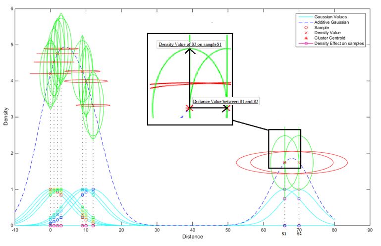

# GDD Clustering
## Distance and density based clustering algorithm using Gaussian kernel
You can access the paper using the link below: 

https://www.sciencedirect.com/science/article/abs/pii/S095741741630553X

 
<strong>Figure 1</strong> - Example of clustering process for 1D data.

## Properties 
* No parameter is needed
* Similarities are grouped together (see Figure 1)

### <strong>[Please cite as]:</strong>
>  Emre Güngör, Ahmet Özmen, Distance and density based clustering algorithm using Gaussian kernel, In Expert Systems with Applications, Volume 69, 2017, Pages 10-20, ISSN 0957-4174, https://doi.org/10.1016/j.eswa.2016.10.022.
(http://www.sciencedirect.com/science/article/pii/S095741741630553X)

for clustering datasets and or shapesets, you can look;
https://cs.joensuu.fi/sipu/datasets/